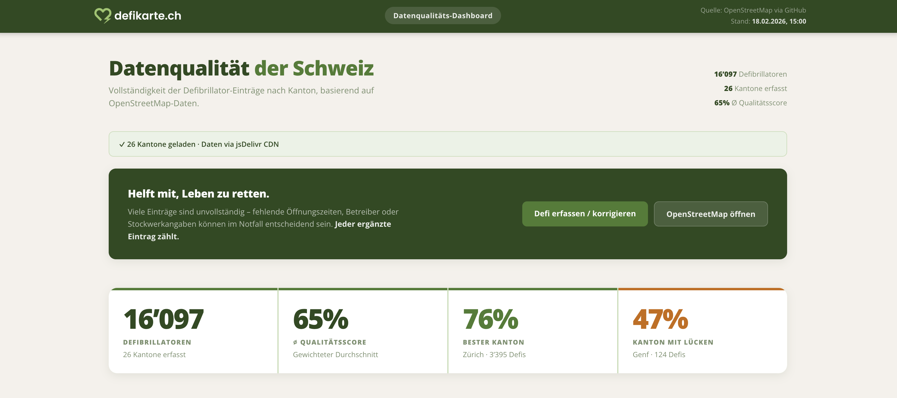

# Defikarte.ch Statistiken Schweiz

## Funktion

Die ganze Funktion ist in `index.html`abgelegt. Grundsätzlich werden vom Github Repository https://github.com/OpenBracketsCH/defi_data stündlich die neusten Daten gezogen. Das Dashboard aktualisiert sich dann automatisch mit. Wenn kein GeoJSON gefunden wird, werden auch keine Daten angezeigt. Es gibt kein Caching der Daten.

## Erklärung zum Dashboard

### Datenqualität

Der Reiter Datenqualität zeigt kurz und prägnant die Qualität der Daten über die gesamte Schweiz. Dabei wird ein Qualitäts-Score vergeben, dieser berechnet sich aus positiven und negativen Werten. Diese Werte generieren sich von den erhobenen Kernattributen und ob diese erfasst sind:

* Standortbeschreibung
* Innen vs. Aussen
* Betreiber
* Zugänglichkeit
* Öffnungszeiten
* Telefonnummer
* Beschreibung
* Stockwerk
* Rollstuhlzugang

### Kantons-Rangliste

Der Reiter Datenqualität ist auf jeden Kanton aufgeschlüsselt in die oben erwähnten Punkte. Somit kann man pro Kanton Schlüsse ziehen wie es um die Datenqualität steht.

### Grafik exportieren

Es lassen sich für die Kantone oder dann schweizweit die Werte als Grafik exportieren. Das kann helfen, wenn ein Kanton sich selber bewerten und dies publizieren will.
