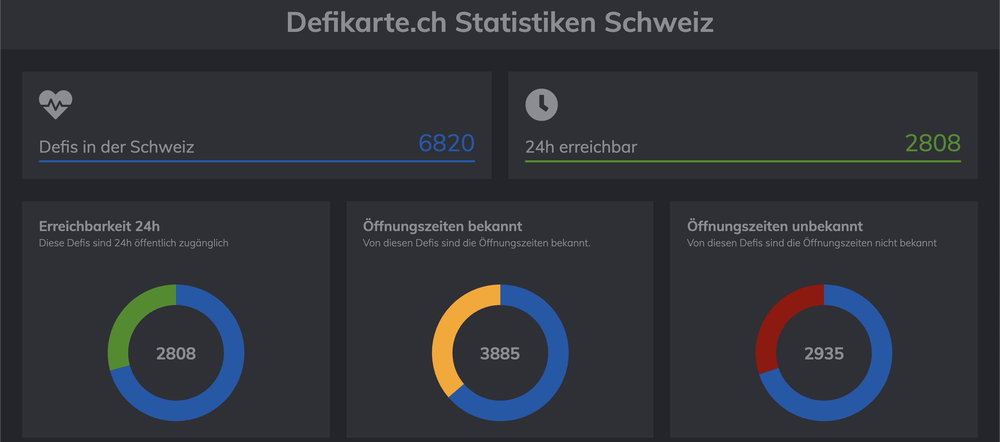

# Defikarte.ch Statistiken Schweiz

## Erklärung zum Dashboard und den Grafiken

### Erreichbarkeit 24h

Diese Grafik zeigt in `grün` die Menge an Defis die 24h öffentlich verfügbar sind, in Relation zur Gesamtzahl aller Defis in der Schweiz.

### Öffnungszeiten bekannt

Diese Grafik zeigt in `gelb` die Menge an Defis bei denen die Öffnungszeiten bekannt und gepflegt sind, in Relation zur Gesamtzahl aller Defis in der Schweiz.

### Öffnungszeiten bekannt

Diese Grafik zeigt in `rot` die Menge an Defis bei denen die Öffnungszeiten unbekannt und nicht gepflegt sind, in Relation zur Gesamtzahl aller Defis in der Schweiz.

### Defis nach Kantonen

Diese Grafik zeigt in einem Barchart die Gesamtzahl an Defis pro Kanton an. Fahre mit der Maus über die Grafik um Kantone zu sehen.

### Datentrend

Diese Grafik zeigt den Trend der Daten der letzten Tage an. Wenn alles gut läuft sollte diese Grafik immer anteigend sein.

## Backend

Das Repository zum Python Backend findet ihr [bei Github](https://github.com/chnuessli/defi_stats_backend)